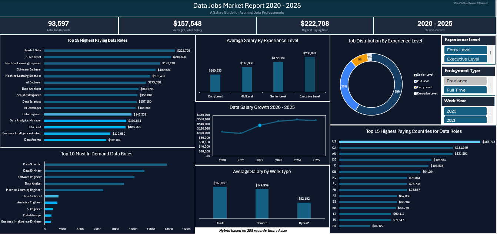

# 📊 Data Jobs Market Report 2020–2025
### An Interactive Excel Dashboard | Salary Guide for Aspiring Data Professionals

---

## 📌 Project Overview

This project is an interactive Excel dashboard analysing **93,597 global data job salary records** sourced from Kaggle. The goal was to help aspiring data professionals understand the current job market — which roles pay the most, where the opportunities are, and how salaries have grown over time.

This was built entirely in **Microsoft Excel** using Power Query, PivotTables, PivotCharts and Slicers.

---

## 🗂️ Dataset

- **Source:** Kaggle — Data Science Job Salaries Dataset
- **Records:** 93,597 rows
- **Columns:** 11 (job title, experience level, employment type, salary, company location, remote ratio and more)
- **Coverage:** 2020 – 2025 | Global (15+ countries)
- **Salary Currency:** All salaries standardised to USD using the `salary_in_usd` column

---

## 🧹 Data Cleaning

All cleaning was performed in **Power Query** with every step recorded in the Applied Steps panel.

| Issue Found | Action Taken |
|-------------|-------------|
| Experience level stored as codes (EN, MI, SE, EX) | Decoded to Entry Level, Mid Level, Senior Level, Executive Level |
| Employment type stored as codes (FT, PT, CT, FL) | Decoded to Full Time, Part Time, Contract, Freelance |
| Company size stored as codes (S, M, L) | Decoded to Small, Medium, Large |
| Remote ratio stored as numbers (0, 50, 100) | Decoded to Onsite, Hybrid, Remote |
| Job titles with fewer than 100 records inflating salary averages | Minimum 100 record threshold applied to salary analysis |
| Countries with fewer than 50 records skewing country averages | Minimum 50 record threshold applied — removed QA (2 records) and VE (1 record) |
| Vague job titles (Engineer, Analyst, Manager, Associate) | Excluded from job frequency chart to focus on specific data roles |
| Raw salary column in mixed currencies | Used salary_in_usd exclusively for all analysis |

---

## 📊 Dashboard Features

### Charts
| # | Chart | Type | Insight |
|---|-------|------|---------|
| 1 | Top 15 Highest Paying Data Roles | Horizontal Bar | AI roles dominate — Head of Data earns $222,708 avg |
| 2 | Average Salary by Experience Level | Column | Each level adds $40,000+ — Entry avg is $100,060 |
| 3 | Data Salary Growth 2020–2025 | Line | 56% salary growth — biggest jump in 2022 |
| 4 | Top 10 Most In-Demand Data Roles | Horizontal Bar | Data Scientist leads with 13,848 records |
| 5 | Average Salary by Work Type | Column | Onsite pays more than Remote — $169K vs $149K |
| 6 | Job Distribution by Experience Level | Donut | 58% of roles require Senior level experience |
| 7 | Top 15 Highest Paying Countries | Horizontal Bar | US leads at $163,452 — followed by Canada and Australia |

### Interactive Slicers
- **Work Year** — filter by year from 2020 to 2025
- **Experience Level** — filter by Entry, Mid, Senior or Executive
- **Employment Type** — filter by Full Time, Part Time, Contract or Freelance

### Summary Cards
- Total Job Records — 93,597
- Average Global Salary — $157,548
- Highest Paying Role — Head of Data at $222,708
- Years Covered — 2020 to 2025

---

## 🔍 Key Findings

1. **AI is the premium skill** — Head of Data, AI Architect and ML Engineer all exceed $190,000 average salary, confirming that AI specialisation commands the highest compensation
2. **Experience is the biggest salary driver** — Moving from Entry to Executive level adds over $100,000 in average salary
3. **2022 was the breakout year** — Average salaries jumped $34,000 in a single year driven by post-pandemic tech hiring demand
4. **Onsite pays more than remote** — Contrary to popular belief, onsite roles average $169,112 vs $149,252 for remote
5. **The market favours experienced professionals** — 58% of roles require Senior level experience with only 9% at Entry level
6. **North America dominates** — US, Canada and Australia all exceed $130,000 average salary
7. **Data Scientist is the sweet spot** — Highest job count at 13,848 combined with a strong average salary of $156,931

---

## ⚠️ Data Limitations

- **Hybrid sample size is very small** — only 298 records out of 93,597, so the hybrid salary figure may not be statistically representative
- **Salaries represent averages** — actual compensation varies. Median would provide a more robust measure but is not natively supported in Excel PivotTables
- **Dataset is a salary survey** — records represent reported salaries not unique job postings, so job count figures reflect survey responses not actual vacancy numbers
- **Country codes used** — company_location follows ISO 3166-1 alpha-2 standard (e.g. US, GB, CA)

---

## 🛠️ Tools Used

| Tool | Purpose |
|------|---------|
| Microsoft Excel | Primary tool for all analysis and visualisation |
| Power Query | Data cleaning, transformation and column decoding |
| PivotTables | Data aggregation and summarisation |
| PivotCharts | Data visualisation |
| Slicers | Interactive dashboard filtering |

---

## 📁 Files in This Repository

| File | Description |
|------|-------------|
| `Data_Jobs_Market_Report.xlsx` | Full interactive Excel dashboard |
| `dashboard_preview.png` | Screenshot of the finished dashboard |
| `README.md` | Project documentation |

---

## 🚀 How to Use

1. Download **Data_Jobs_Market_Report.xlsx**
2. Open in Microsoft Excel — enable content if prompted
3. Navigate to the **Dashboard** sheet
4. Use the slicers on the right to filter by Year, Experience Level or Employment Type
5. All 7 charts update simultaneously when slicers are selected

---

## 👩‍💻 About

Built by **Miriam S Maseko** — Third Year Computer Science Student at the National University of Science and Technology (NUST), Zimbabwe.

This is my first data analysis portfolio project. I am actively looking for internship opportunities in data analysis and technology.

📧 mirriamsthablem28@gmail.com
🔗 [LinkedIn](www.linkedin.com/in/
mirriam-s-maseko
Vanity URL name
)

---

*Dataset sourced from Kaggle. All analysis and visualisation built independently in Microsoft Excel.*
